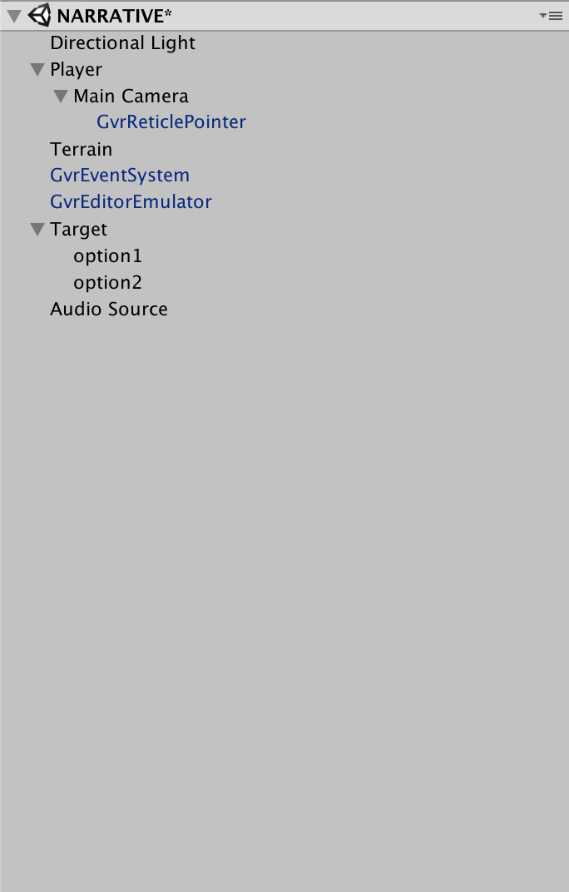
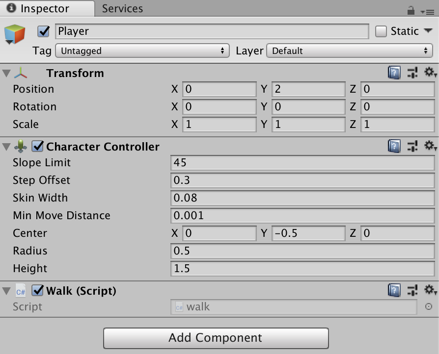
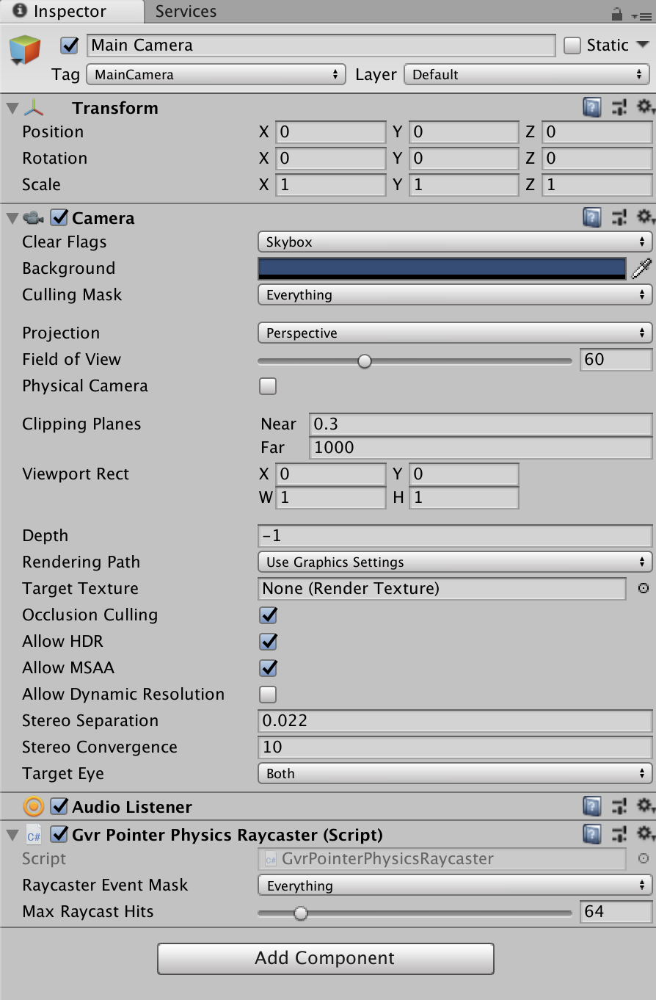
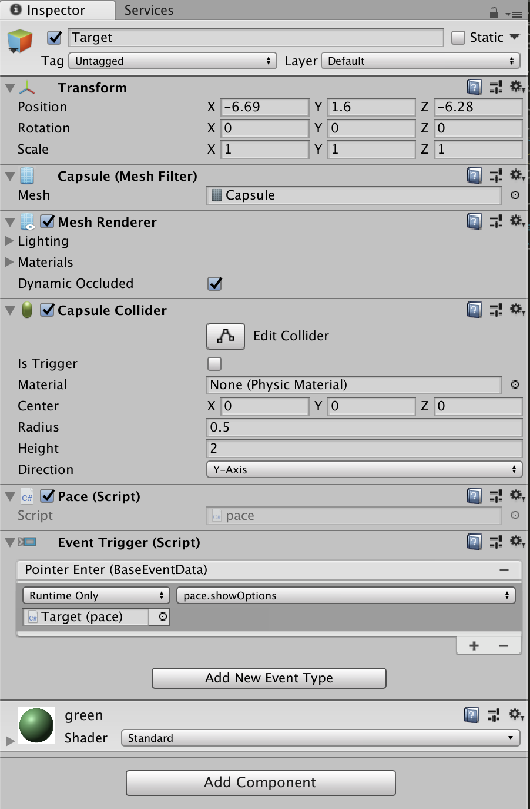
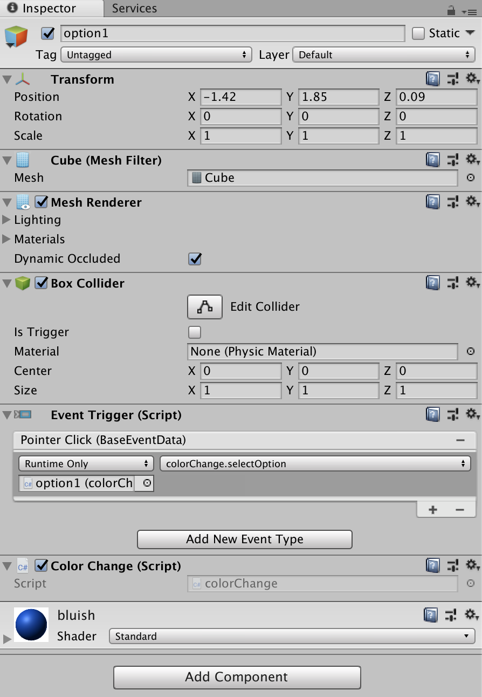
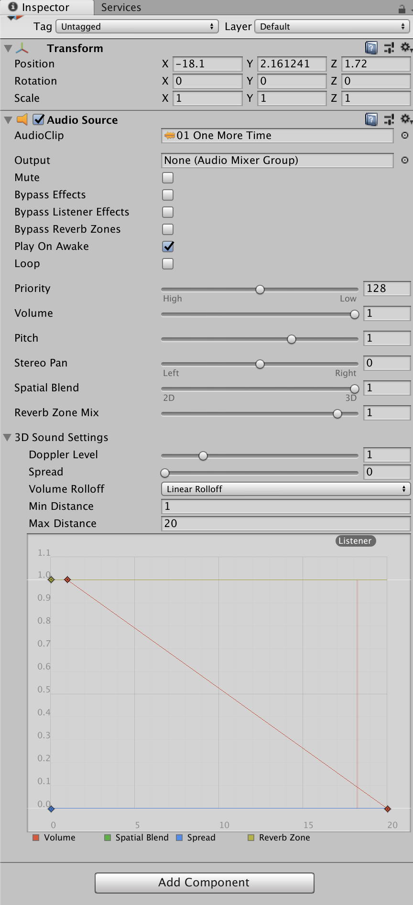

### Week Interactive Story in Unity

-----

Let's construct a model for an interactive story in Unity. It will be composed of the following parts.

- 1st-Person, Movable *Hero* Player
- Searched-For *Target* Character
- 2 *Options* Offered by *Target* to *Hero*
- Sound Source Helping *Hero* find the *Mentor*


-----

### Change Build Settings and Player Settings, and Import GVR Assets

`File -> Build Settings`

*Switch Platform* to Android, and enable VR Support for *Cardboard* in Player Settings under *XR Options*.

`Assets -> Import Package` and bring in all of the assets in the [Google VR Unity Package](https://github.com/googlevr/gvr-unity-sdk/releases).

-----

### Create Scene Hierarchy

Your scene should look like this...



Blue objects are imported prefabs from the GVR asset package (search for their names). Black objects are created by right-clicking in the Hierarchy and adding 3D Objects. Everything not listed just uses the default settings.

-----

#### Manipulate the Terrain

Edit the settings in the Terrain Object by selecting it, and then clicking on the gear icon in the Inspector. Use various brushes to form the height of the terrain.

More settings, like tree creation and deployment, are explained in this [Terrain Creation Tutorial](https://www.youtube.com/watch?v=OShNQaiWz2Y).

-----

#### Player Settings



*Add component* on the player to add a *Character Controller* as well as a new script called *walk* that looks like this.

```c#
using System.Collections;
using System.Collections.Generic;
using UnityEngine;

public class walk : MonoBehaviour {
    private CharacterController _controller ;

    // Use this for initialization
    void Start () {
        //reference character controller script
        _controller = GetComponent<CharacterController>();
    }
    
    // Update is called once per frame
    void Update () {
        //capture left/right input
        float x = Input.GetAxis("Horizontal");
        //gravity
        float y = -.3f;
        //capture up/down and map it to forward/back
        float z = Input.GetAxis("Vertical");

        //synthesize a new vector
        Vector3 move = new Vector3(x, y, z);

        //move character
        _controller.Move(move * Time.deltaTime * 3);
    }
}
```

Make sure the *CharacterController* settings place the capsule collider mesh totally on top of the terrain by editing its *Center*, *Radius*, and *Height*.

-----

#### Main Camera Settings



Drag a *GVR Pointer Physics Raycaster* from the Assets window to the Main Camera. Tag the Main Camera with *MainCamera*.

-----

#### Target Settings



This 3D Capsule Object has an *Event Trigger* component added to it, which activates a script called *pace* that moves the character back and forth, hides the options on launch, and shows the options objects if the *Hero* makes eye contact.

```c#
using System.Collections;
using System.Collections.Generic;
using UnityEngine;

public class pace : MonoBehaviour {

    // Use this for initialization
    void Start () {
        //hide our option boxes on launch
        GameObject.Find("option1").GetComponent<Renderer>().enabled = false;
        GameObject.Find("option2").GetComponent<Renderer>().enabled = false;
    }

    //default movement direction and speed
    float increment = .05f;

    // Update is called once per frame
    void Update () {

        //change capsule movement under certain conditions
        if (this.transform.position.x > -3){
            increment = -.05f;
        }
        else if (this.transform.position.x < -8){
            increment = .05f;
        }

        //create new x position
        float x = this.transform.position.x + increment;

        //move object
        this.transform.position = new Vector3(x, this.transform.position.y, this.transform.position.z);
    }

    public void showOptions(){
        //if capsule receives pointer enter show the options
        GameObject.Find("option1").GetComponent<Renderer>().enabled = true;
        GameObject.Find("option2").GetComponent<Renderer>().enabled = true;
        increment = 0;
    }
}

```

-----

#### Option Box Settings



These cubes are placed above the *Target* capsule and have a similar *Event Trigger* attached to each, with a script called *colorChange1* and *colorChange2* respectively.

These scripts are near identical and look like this. Only the final color is different.

```c#
using System.Collections;
using System.Collections.Generic;
using UnityEngine;

public class colorChange : MonoBehaviour {

    // Use this for initialization
    void Start () {
        
    }
    
    // Update is called once per frame
    void Update () {
        
    }

    //when the option is point clicked...

    public void selectOption(){
        //look for the target and change its color
        GameObject.Find("Target").GetComponent<Renderer>().material.color = new Color(0.0f,0.0f,1.0f);
    }
}
```

-----

#### Audio Source Settings



Change the *AudioClip* to an imported mp3 file. Make sure you adjust the *Spatial Blend* to fully 3D and then adjust the *Min* and *Max Distance* to change the sound's reach.

-----

##### References

- [Unity Scripting API](https://docs.unity3d.com/ScriptReference/Transform.html)
- [Cardboard Developer Homepage](https://vr.google.com/cardboard/developers/)
- [Google Functional Design Guidelines](https://designguidelines.withgoogle.com/cardboard/) 

-----

##### Homework

Week off! 
