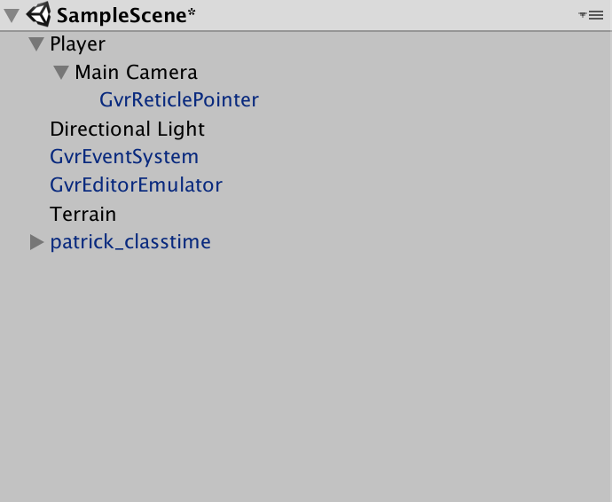
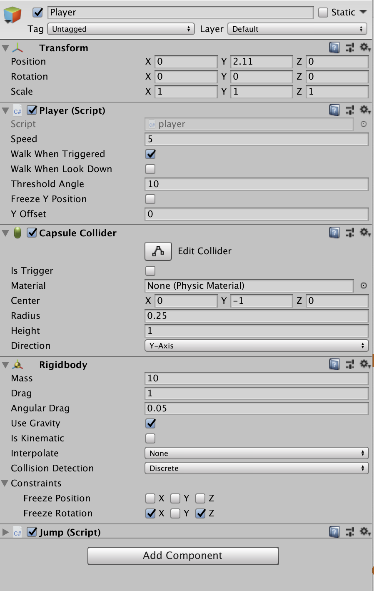
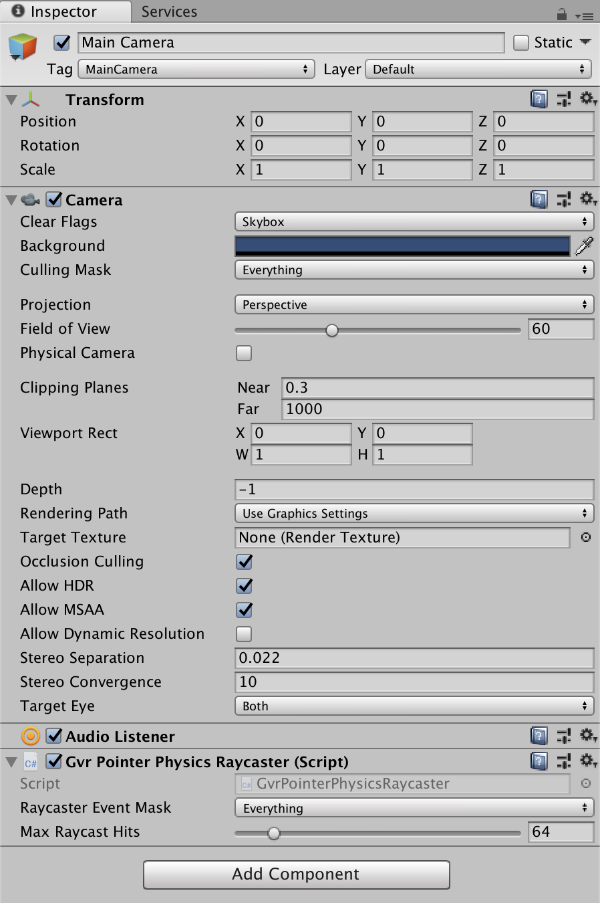

### Custom Animations in Unity

-----

Let's construct a model for an interactive story in Unity. It will be composed of the following parts.

- 1st-Person, Movable *Hero* Player that Can Move Around in 2 Different Ways and Jump
- Engagable, Animated Non-Player Character with Custom Animations


-----

### Change Build Settings and Player Settings, and Import GVR Assets

`File -> Build Settings`

*Switch Platform* to Android, and enable VR Support for *Cardboard* in Player Settings under *XR Options*.

`Assets -> Import Package` and bring in all of the assets in the [Google VR Unity Package](https://github.com/googlevr/gvr-unity-sdk/releases).

-----

### Model and Animate in Maya

- Model your character at rest
- If desired... Modify -> Convert -> Smooth Mesh Preview to Polygons
- Make a copy of the file
- Rig your model with Quick Rig or by creating an IK skeleton
- Create your animations in an extended timeline. Make sure your character comes back to the rest position after each animation, and leave room in your timeline for editing.
- Export with the following settings in File -> Game Exporter


After importing the .fbx file into Maya, select the mesh in the asset window and, under *Rig*, set your *Animation Type* to *Legacy*.

-----

### Create Scene Hierarchy

Your scene should look like this...



Blue objects are imported prefabs from the GVR asset package (search for their names) and Maya objects. Black objects are created by right-clicking in the Hierarchy and adding 3D Objects. Everything not listed below just uses the default settings.

-----

#### Manipulate the Terrain

Edit the settings in the Terrain Object by selecting it, and then clicking on the gear icon in the Inspector. Use various brushes to form the height of the terrain.

More settings, like tree creation and deployment, are explained in this [Terrain Creation Tutorial](https://www.youtube.com/watch?v=OShNQaiWz2Y).

-----

#### Player Settings



*Add component* on the player to add a *Rigidbody*, *Capsule Collider*, as well as a new script called *Player* that looks like this...

```c#
using UnityEngine;
using System.Collections;

public class player : MonoBehaviour
{
    private const int RIGHT_ANGLE = 90;

    // This variable determinates if the player will move or not 
    private bool isWalking = false;

    Transform mainCamera = null;

    //This is the variable for the player speed
    [Tooltip("With this speed the player will move.")]
    public float speed;

    [Tooltip("Activate this checkbox if the player shall move when the Cardboard trigger is pulled.")]
    public bool walkWhenTriggered;

    [Tooltip("Activate this checkbox if the player shall move when he looks below the threshold.")]
    public bool walkWhenLookDown;

    [Tooltip("This has to be an angle from 0° to 90°")]
    public double thresholdAngle;

    [Tooltip("Activate this Checkbox if you want to freeze the y-coordiante for the player. " +
             "For example in the case of you have no collider attached to your CardboardMain-GameObject" +
             "and you want to stay in a fixed level.")]
    public bool freezeYPosition;

    [Tooltip("This is the fixed y-coordinate.")]
    public float yOffset;

    void Start()
    {
        mainCamera = Camera.main.transform;
    }

    void Update()
    {
        // Walk when the Cardboard Trigger is used 
        if (walkWhenTriggered && !walkWhenLookDown && !isWalking && Input.GetButtonDown("Fire1"))
        {
            isWalking = true;
        }
        else if (walkWhenTriggered && !walkWhenLookDown && isWalking && Input.GetButtonDown("Fire1"))
        {
            isWalking = false;
        }

        // Walk when player looks below the threshold angle 
        if (walkWhenLookDown && !walkWhenTriggered && !isWalking &&
            mainCamera.transform.eulerAngles.x >= thresholdAngle &&
            mainCamera.transform.eulerAngles.x <= RIGHT_ANGLE)
        {
            isWalking = true;
        }
        else if (walkWhenLookDown && !walkWhenTriggered && isWalking &&
                 (mainCamera.transform.eulerAngles.x <= thresholdAngle ||
                 mainCamera.transform.eulerAngles.x >= RIGHT_ANGLE))
        {
            isWalking = false;
        }

        // Walk when the Cardboard trigger is used and the player looks down below the threshold angle
        if (walkWhenLookDown && walkWhenTriggered && !isWalking &&
            mainCamera.transform.eulerAngles.x >= thresholdAngle &&
            Input.GetButtonDown("Fire1") &&
            mainCamera.transform.eulerAngles.x <= RIGHT_ANGLE)
        {
            isWalking = true;
        }
        else if (walkWhenLookDown && walkWhenTriggered && isWalking &&
                 mainCamera.transform.eulerAngles.x >= thresholdAngle &&
                 (Input.GetButtonDown("Fire1") ||
                 mainCamera.transform.eulerAngles.x >= RIGHT_ANGLE))
        {
            isWalking = false;
        }

        if (isWalking)
        {
            Vector3 direction = new Vector3(mainCamera.transform.forward.x, 0, mainCamera.transform.forward.z).normalized * speed * Time.deltaTime;
            Quaternion rotation = Quaternion.Euler(new Vector3(0, -transform.rotation.eulerAngles.y, 0));
            transform.Translate(rotation * direction);
        }

        if (freezeYPosition)
        {
            transform.position = new Vector3(transform.position.x, yOffset, transform.position.z);
        }
    }
}
```
Make sure the capsule collider mesh is placed totally on top of the terrain by editing its *Center*, *Radius*, and *Height*. 

-----

#### Main Camera Settings



Drag a *GVR Pointer Physics Raycaster* from the Assets window to the Main Camera. Tag the Main Camera with *MainCamera*.

-----

#### NPC Settings


This imported Maya character has animations that can be triggered by user interactions. 

*Add component* on the NPC to add a *Rigidbody*, *Capsule Collider*, *Animation*, *Event Trigger*, as well as a new script called *Wave* that looks like this...


```c#
using System.Collections;
using System.Collections.Generic;
using UnityEngine;

public class wave : MonoBehaviour {
    private Animation charAnimation;

    // Use this for initialization
    void Start () {
        charAnimation = GameObject.Find("patrick_classtime").GetComponent<Animation>();
    }
    
    // Update is called once per frame
    void Update () {
        
    }

    public void  Greeting () {
        charAnimation.Play("wave");
    }
}

```

Switch the script to reflect the appropriate name of your animated model and its animations.

Make sure the animations are setup correctly in the *Animation Component*, and that the *Capsule Collider* is sized-appropriately to the model. Connect everything together in the *Event Trigger* settings.

-----

##### References

- [Unity Scripting API](https://docs.unity3d.com/ScriptReference/Transform.html)
- [Cardboard Developer Homepage](https://vr.google.com/cardboard/developers/)
- [Google Functional Design Guidelines](https://designguidelines.withgoogle.com/cardboard/) 

-----

##### Homework

Move the Studio!
